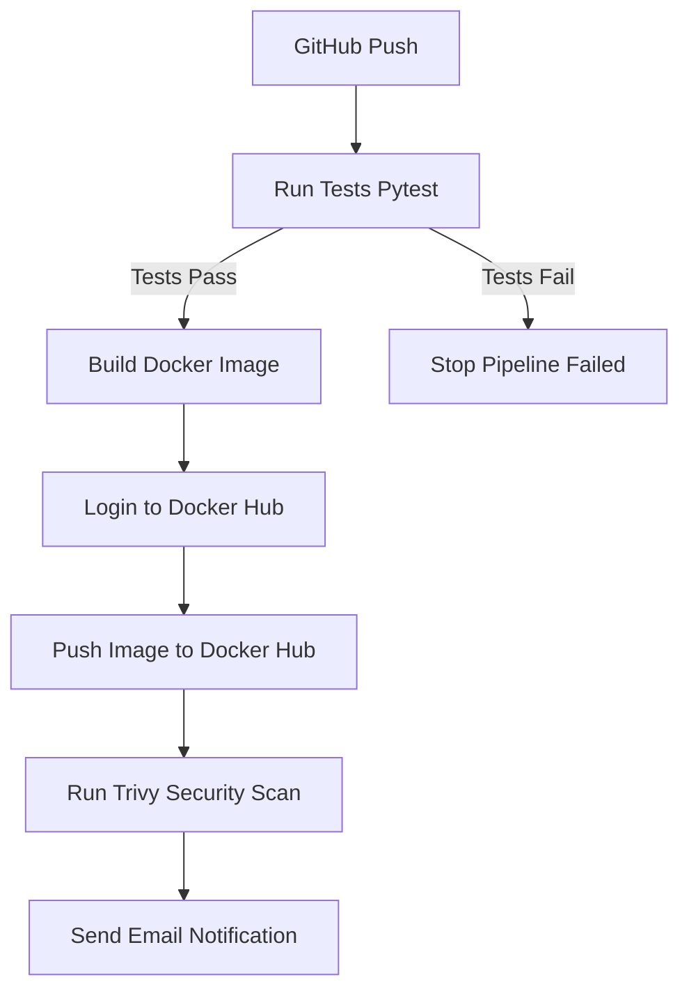

# CI/CD Docker Demo 🚀


This project demonstrates a CI/CD pipeline using:
- GitHub Actions
- Docker
- Python (Flask)
- Pytest + Coverage
- Flake8 linting
- Trivy vulnerability scanning
- Slack notifications (optional)

---

## 🛠 Tech Stack
- **Python 3.11**
- **Flask**
- **Docker**
- **GitHub Actions**

---

## 🔄 CI/CD Pipeline Overview



## 📦 Docker Image
The image is pushed to:
docker.io/YOUR_USERNAME/ci-cd-docker-demo

## 🚀 Setup
```bash
python -m venv venv
source venv/bin/activate  # or .\venv\Scripts\activate on Windows
pip install -r requirements.txt
```

## 🧪 Run Locally
```bash
python app/app.py
```

```yaml
---

### 📄 `.gitignore`

Here's a Python + Docker `.gitignore` you can drop in:

```gitignore
# Python
venv/
__pycache__/
*.py[cod]

# Logs
*.log

# VS Code
.vscode/

# Byte-compiled
*.pyc

# Docker
*.tar
*.img
.dockerignore

# OS junk
.DS_Store
Thumbs.db
```

## ✅ Recommended Initial Project File Structure
Here’s what you want in your repo before the first push:
```plaintext
ci-cd-docker-demo/
├── .gitignore
├── .flake8
├── Dockerfile
├── README.md
├── requirements.txt
├── app/
│   └── app.py
├── tests/
│   └── test_app.py
├── .github/
│   └── workflows/
│       └── main.yml
```

## ✅ Setup & Push Commands
Once these files are in place:
```bash
git init
git add .
git commit -m "Initial commit: project structure, README, gitignore"
git remote add origin https://github.com/YOUR_USERNAME/ci-cd-docker-demo.git
git branch -M main
git push -u origin main
```


